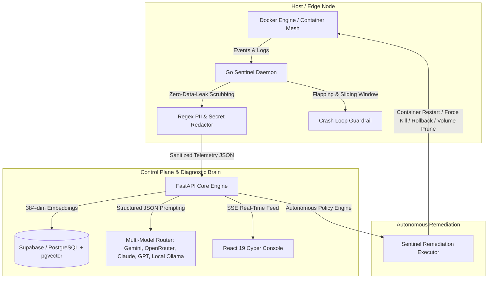

# ⚡ Kintsugi: Autonomous AIOps & Self-Healing Cloud Runtime

<div align="center">

```
  ██╗  ██╗██╗███╗   ██╗████████╗███████╗██╗   ██╗ ██████╗ ██╗
  ██║ ██╔╝██║████╗  ██║╚══██╔══╝██╔════╝██║   ██║██╔════╝ ██║
  █████═╝ ██║██╔██╗ ██║   ██║   ███████╗██║   ██║██║  ███╗██║
  ██╔═██╗ ██║██║╚██╗██║   ██║   ╚════██║██║   ██║██║   ██║██║
  ██║ ╚██╗██║██║ ╚████║   ██║   ███████║╚██████╔╝╚██████╔╝██║
  ╚═╝  ╚═╝╚═╝╚═╝  ╚═══╝   ╚═╝   ╚══════╝ ╚═════╝  ╚═════╝ ╚═╝
```

**Next-Generation Autonomous Incident Response, Semantic Diagnostic Memory & Microservice Self-Healing Mesh**

[](LICENSE)
[](https://fastapi.tiangolo.com)
[](https://golang.org)
[](https://react.dev)
[](https://github.com/pgvector/pgvector)

</div>

---

## 📖 Overview

**Kintsugi** is an enterprise-grade autonomous Site Reliability Engineering (AIOps) system that monitors Docker and Kubernetes container runtimes, automatically intercepts failures, strips sensitive PII/credentials at the edge, vectors error traces against historical incident memory using `pgvector`, and dispatches autonomous self-healing remediation pipelines in milliseconds.

Named after the traditional Japanese art of repairing broken pottery with gold lacquer (*Kintsugi*), the platform treats production failures as opportunities for architectural resilience.

---

## 🏗️ Architecture



---

## ✨ Key Features

- **🚀 Go Sentinel Daemon**: Low-overhead edge agent listening directly to container socket streams with microsecond incident detection.
- **🔒 Zero Data-Leak Sanitizer**: High-speed regex and entropy filters redacting JWTs, API keys, database connection strings, RSA private keys, and passwords before network dispatch.
- **🧠 Multi-Model Diagnostic Engine**:
  - **Google Gemini** (`gemini-3.5-flash`, `gemini-3.5-flash-lite`, `gemini-flash-lite-latest`, Gemma 4)
  - **OpenRouter & Universal Gateways** (Claude 3.7 Sonnet, DeepSeek R1, Llama 3.3 70B, Qwen 2.5 Coder)
  - **OpenAI** (GPT-4o, GPT-4o-mini)
  - **Anthropic** (Claude 3.5 Sonnet, Haiku)
  - **Local Ollama / vLLM / Heuristic Fallbacks**
- **⚡ Semantic Memory (`pgvector`)**: 384-dimensional cosine similarity querying against past cluster outages to accelerate MTTR to sub-second recovery.
- **🛡️ Flapping Circuit Breakers**: Sliding-window algorithms preventing destructive crash loops and auto-escalating to human SREs.
- **🎛️ Dual Operating Modes**:
  - **Active Mode**: Immediate autonomous remediation and health verification.
  - **Passive Sentinel Mode (Dry-Run)**: Observes crashes, runs RCA diagnostics, generates proposals, logs execution traces, and leaves container state unmodified.
- **⚡ Cluster Batch Remediation**: 1-click and interactive CLI commands (`$ heal-all-unresolved`, `heal all`) to sweep and heal all unresolved or passive incidents across the cluster.
- **💻 Cyberpunk Matrix Console**: Real-time HUD, animated ASCII hero banners, demultiplexed live telemetry stream, interactive CLI REPL, and visual vector similarity explorer.

---

## 🚀 Quick Start (Local Docker Compose)

### 1. Clone & Configure
```bash
git clone https://github.com/unxki/kintsugi.git
cd kintsugi
cp .env.example .env
```

### 2. Start the Cluster
```bash
make run
# or
docker compose up --build -d
```

### 3. Access Services
- **Cyber Console**: [http://localhost:5173](http://localhost:5173)
- **FastAPI Core OpenAPI**: [http://localhost:8000/docs](http://localhost:8000/docs)
- **PostgreSQL / pgvector**: `localhost:5432`

---

## 🧪 Testing & Verification

Run the unified test suite across all sub-services:
```bash
make test
```
- **Core Tests**: `pytest` async integration suite with vector similarity tests.
- **Sentinel Tests**: Go unit tests for log sanitization, regex redactors, and flapping detection.
- **Console Tests**: Vite production bundle compilation.

---

## ☁️ Deployment Topology

- **Database**: [Supabase](https://supabase.com) (PostgreSQL + `pgvector` extension enabled)
- **Sentinel Daemon**: Azure Linux VM / Kubernetes DaemonSet with Docker Socket access
- **Frontend Console**: [Vercel](https://vercel.com) / Netlify
- **Core API**: Azure Container Apps / AWS ECS / Fly.io / Render

---

## 📜 License

MIT License. Built with ❤️ for resilient autonomous infrastructure.
